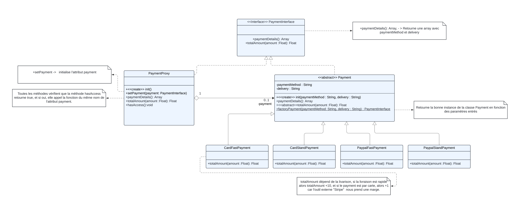

# Rapport SAE Qualite de developpement

Rafael Baudry, Lissillour Noan, Ahamada Ibrahim et Piau Maxime

## Introduction:

#### Au cours de notre SAE nous avons cherché de nombreux design patterns à implémenter pour améliorer notre code. 

#### Le problème étant que beaucoup de ces designs patterns sont implémentés par symphony lui-même.

#### C'est pourquoi nous avons choisi d'implémenter ces designs patterns à un endroit que symphony ne traite pas, c'est à dire le payements. Pour réaliser le payements, nous avons donc utilisé:

#### \-une **factory** pour choisir le mode et les options de payement,

#### \- une **strategy** pour calculer le coûts en fonction du mode et des options de payements choisi,

#### \-un **proxy** pour limiter et sécuriser l'accès à la classe moyens de payements.

#### \-les documents complets se trouvent à la fin du rapport.

## Factory pattern:

### Justifier votre choix de ce design pattern (le pourquoi ?)

Après avoir commencer à implémenter les modes de payements, nous nous sommes rendus compte que les utilisateurs avaient le choix entre de nombreuses options. Implémenter ces options dans une seule et même classe nous a semblé être une très mauvaise idée de par la taille de la classe et surtout, pour créer un nouveau mode de payements il aurait fallu modifier une grande partie de la classe.

C'est pourquoi nous avons choisi de faire une factory dans la classe Payement, pour qu'en fonction des options choisi la factory puisse implémenter la sous-classe correspondante( par exemple si l'utilisateurs a choisi livraison rapide et paypal, alors la classe qui traitera le payement sera PaypalFastPayement. 

De plus, il est plus simple de créer des sous-classes rapides avec peu de méthode que de modifier directement la classe principale(bien que l'on doit toujours rajouter un if dans la factory).

### Illustrer et expliquer le DP choisi (le quoi ?)

#### Factory Payment:


Ici on peut voir que la super-classe Payment possède 2 attributs(pour l'instant), et donc elle utilise une factory pour instancier les sous-classes correspondantes au attributs, nous permettant par la même occasion de mieux gérer le payement s'il existe des méthodes qui diffère en fonction des attributs.(coût du produit ou infos à fournir en fonction du mode de payement.)

A noter que cette implémentation nous facilitera l'amélioration du site lors de prochains ajouts.

#### 

##### Notre définition de la factory:

La factory est un design pattern qui permet à une super-classe d'instancier des sous-classes plus spécialisé en fonction de leurs paramètres.

### Présenter son implémentation (le comment ?)

#### Factory Payment:

```php
public static function factoryPayment(string $paymentMethod, string $delivery): PaymentInterface{
if ($paymentMethod == "card" && $delivery=="fast"){
	return new CardFastPayment($paymentMethod, $delivery);
}
if ($paymentMethod == "card" && $delivery=="standard"){
	return new CardStandPayment($paymentMethod, $delivery);
}
if ($paymentMethod == "paypal" && $delivery=="fast"){
	return new PaypalFastPayment($paymentMethod, $delivery);
}
if ($paymentMethod == "paypal" && $delivery=="standard"){
	return new PaypalStandPayment($paymentMethod, $delivery);
}
throw new \\Exception("The payment method or delivery is invalid");
}
```

Pour ce factory, nous avons pas eu trop de choix de réalisation, la seule différence remarquable avec les factory est que en php, le companion object n'existe pas, on crée donc une fonction statique. A par cela le code est assez simple, par rapport aux paramètres, on instancie la sous-classe la plus adaptés.

Si aucune classe n'est adaptés alors on retourne une exception.

## Strategy pattern:

### Justifier votre choix de ce design pattern (le pourquoi ?)

Lorsque l'on a commencé à s’intéresser aux payements, nous nous sommes rendus compte que le prix du produit pouvait largement varié en fonction des options prises par les utilisateurs( si ils souhaitent avoir leur produit plus rapidement, si ils viennent d'un autre pays,...).

Le choix le plus juste aurait été de créer une même fonctions avec énormément de condition pour renvoyer un prix juste, problème, de une ce n'est pas très propre, et de deux , si une option vient complètement changer le prix alors il sera assez dure de l'implémenter. 

Ici le strategy semble donc être la solution optimale, une même fonctions qui renvoi un choix différent en fonction des paramètre de la classe.

De plus, comme nous avons pu le voir avec les nombreux TD du cours R.304, le design pattern strategy se marie très bien avec le factory.

Nous avons donc créer une méthode abstraite totalAmount() dans la super-classe Payment,que nous implémentons différemment dans les sous-classes. 

### Illustrer et expliquer le DP choisi (le quoi ?)

#### Le Strategy payment:


Ici, nous pouvons observer un design pattern factory dans la classe abstraite Payment, nous pouvons aussi voir une méthode abstraite totalAmount, la classe Payment instancie plusieurs sous-classe, chacunes de ces sous-classes possède la même méthode totalAmount, mais renvoie des résultats qui diffère en fonction des options prise.

Là encore pour rajouter des nouveaux modes de payements et options nous avons juste à créer de nouvelles classes.

##### Notre définition de Strategy:

Le strategy pattern permet à plusieurs sous-classes d'une super-classe d'implémenter la même méthode pour obtenir des résultats différent.

### Présenter son implémentation (le comment ?)

```php
class CardStandPayment extends Payement{
    protected string $paymentMethod;
    protected string $delivery;
    public function __construct($paymentMethod, $delivery){
        $this->paymentMethod = $paymentMethod;
        $this->delivery = $delivery;
    }
    public function totalAmount(float $amount): float{
        return $amount+1;
    }
}

class PaypalFastPayment extends Payment{
    protected string $paymentMethod;
    protected string $delivery;

    public function __construct($paymentMethod, $delivery){
        $this->paymentMethod = $paymentMethod;
        $this->delivery = $delivery;
    }
    public function totalAmount(float $amount): float{
        return $amount +10;
    }
}
```

Encore une fois, il n'y a pas vraiment de différence remarquables entre le strategy de kotlin et celui du php.

Si le moyen de payment est une carte, alors avec Stripe(gestionnaire externe de payements par carte) nous faisons payer 1 € de plus, si la livraison est rapide, c'est alors 10 € de plus au prix de base du produit.

Pour l'instant, le strategy n'implémente qu'une méthode mais il est facile d'imaginer un futur, où une implémentation de plusieurs méthodes est requise.

## Proxy pattern:

### Justifier votre choix de ce design pattern (le pourquoi ?)

Ce design pattern est de loin le design pattern, nous ayant demander le plus de concertation.

En effet, celui-ci permet de réaliser de nombreuses actions, mais est-il vraiment utiles?

Un problème que nous avons eu, à été de vérifier si les utilisateurs avaient les droits nécessaire pour effectuer le payements, nous avons donc créer un rôle "ROLE_VERIFIED" pour vérifier qu'il avait une adresse mail vérifié valide.  
Dans la solution initiale nous voulions juste créer une méthode dans la classe Payements pour vérifier si les utilisateurs avaient le droit de procéder au payement. Mais étant donner que la classe payement était trop complexe, nous avons choisi de créer un proxy.

Les but du proxy sont nombreux, mais il permet entre autre, de vérifier un accès et donc de limiter le nombre de personnes qui utilise la classe qu'il protège.

Vue que Payement est une classe sensible, qui permet de recueillir des informations importantes, sur les utilisateurs. Un proxy est donc le choix idéal.

Bien que le code sera plus complexe, il est supposé être plus sécurisé et moins gourmand, moins d'accès à une classe importante.

### Illustrer et expliquer le DP choisi (le quoi ?)

#### Le Proxy payment:


Ici l'interface PaymentInterface est implémenté par PaymentProxy et Payment, le proxy possède un attribut de type PaymentInterface. Avec cette attribut il va réaliser les méthode de la classe Payment. Avant de  réaliser chaque méthode, il va d'abord demander si l'utilisateur à un accès avec hasAccess. Dans notre code, l'accès est définis par le rôle Verified.

Ici comme on le voit, lorsque qu'un utilisateur choisit son payements, le programme va d'abord l'envoyer sur le proxy pour éviter de charger la classe plus coûteuse Payment.

Dans le futur, au fur et à mesure que la classe Payment va évoluer, le proxy deviendra de plus en plus important.

##### Notre définition du Proxy (avec refactoring guru):

Proxy est un design pattern qui permet de produire un substitut d'une classe, ce substitue dépend de la classe, et à chaque appel à la classe passe par son substitue.

Si l'information est correcte, alors le proxy créer un vrai service et délègue ses fonctions au service.

### Présenter son implémentation (le comment ?)

```php
private ?PaymentInterface $payment = null;
    public function setPayment(PaymentInterface $payment){
            $this->payment=$payment;
    }
    public function totalAmount(float $amount): float{
        $this->hasAccess();
        if($this->payment==null){
            throw new \RunTimeException("Payement not set");
        }
        return $this->payment->totalAmount($amount);
    }
    public function paymentDetails(): array{
        $this->hasAccess();
        if($this->payment==null){
            throw new \RunTimeException("Payement not set");
        }
        return $this->payment->paymentDetails();

    }
    private function hasAccess():void{
        if (in_array("ROLE_VERIFIED",$this->getUser()->getRoles())){
            return;
        }else{
            throw new \Exception('Access denied: Make sure to verify your email before paying');
        }
    }
```

Ici, nous n'avons jamais implémenté de proxy, nous n'avons donc pas pu trouver de différence avec kotlin, les choix que nous avons faits sont les suivants:

- Pour le proxy ce qui nous permet de vérifier les utilisateurs et la fonction hasAccess, où l'on cherche si l’utilisateur à le rôle "ROLE_VERIFIED", si il possède le rôle alors la fonction ne fait rien, sinon elle renvoie une exception,
-  Nous avons choisi de renvoyer une exception pour facilement identifier les erreurs dans notre code( nous aurions simplement pu faire un booléens). Un catch de tous les exception se trouve dans le controller( fin du rapport).
- Avons d'appeler la méthode sur Payment, nous regardons si Payment à déjà été définie par setPayment, sinon on retourne une exception. Dans le contrôleur nous créons un proxy, puis nous appelons directement la méthode setPayment.

### __Documents utiles:__

#### UML Payment : 



#### ControllerPayment:

```php
public function processPayment(Request $req, PaymentProxy $proxy): Response{
       $payment= $req->request->get('paymentMethod');
       $delivery= $req->request->get('delivery');
       $amount= $req->request->get('amount');
       if ($delivery!="fast"){
           $delivery="standard";
       }
       try{
        $payment = Payment::factoryPayment($payment,$delivery);
        $proxy->setPayment($payment);
        $totalAmount = $proxy->totalAmount(floatval($amount));
        return $this->render('payment/index.html.twig',[
           'details' => $proxy->paymentDetails(),
           'totalAmount' => $totalAmount,
           'cartCount'=>0
       ]);
       }catch(\Exception $e){
            dd($e);
            return $this->redirectToRoute('app_order');
       } 
   }
```

Ce controller gère la validation du paiement en récupérant toutes les informations utiles à cette action. Comme par exemple le moyen de paiement et le type de livraison souhaité. Nous instancions par la suite la bonne classe avec la factory qui prend en paramètre le type de paiement et livraison récupéré plus haut. Puis, avec la bonne classe, nous appelons le proxy pattern  afin de récupérer les bons prix avec en plus de cela un petit message customisé. La page est ensuite générée avec les bonnes valeurs.  

#### Bonus:

##### une sorte de Factory AddresseSetter:


Cette factory implémenté dans la classe OrderRepository a pour but d'optimiser l’implémentation pour l'enregistrement des adresses des utilisateurs lors de la validation du panier puisqu'ils possède 2 adresses : une adresse de facturation et une adresse de livraison. Ces 2 adresses sont enregistré dans la base de donnée a 2 moments différents dans notre procédure d'enregistrement (d’où la fonction giveNextPageStep()), et nous ne pouvons donc pas envoyer d'un coup les 2 adresses via une seule fonction. D'ou l'interet de faire 2 classes qui s'occupe de leurs propres adresses. Il manque ici la fonction pour envoyer les données car je ne sais pas encore comment elle sera implémenter

#### Le code :

Elle permet d'instancier la bonne classe en fonction de type

```php
public function orderFactory(string $type, array $adressInfos){
       if($type == "facturation"){
            return new Facturation($adressInfos,);
       }else if($type == "livraison"){
            return new Livraison($adressInfos);
       }else{
            throw new \Exception('impossible de créer l\'élement :'.$type);
        }
    }
```